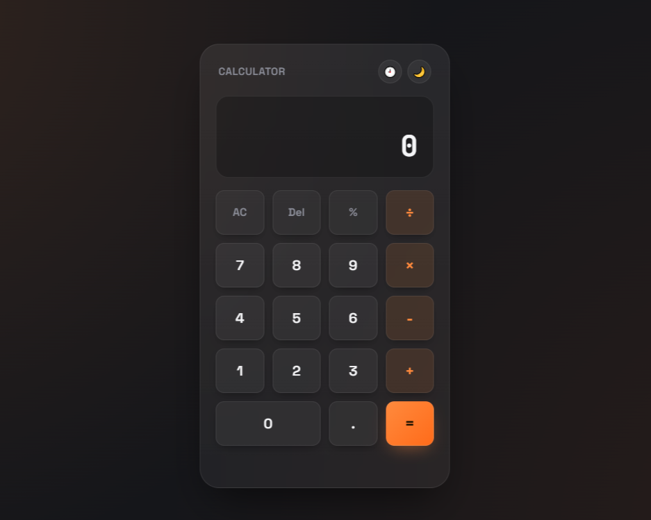

# 🧮 CodeAlpha Calculator

A modern and responsive calculator web application built using HTML, CSS, and JavaScript as part of the CodeAlpha Frontend Development Internship.

## 🚀 Features

* Basic arithmetic operations

  * Addition
  * Subtraction
  * Multiplication
  * Division
* Responsive calculator layout
* Real-time input and calculation
* Clear and delete functionality
* Keyboard support
* Modern dark-themed user interface
* Smooth button animations and hover effects

## 🛠️ Technologies Used

* HTML5
* CSS3
* JavaScript (Vanilla JS)

## 📱 Responsive Design

The calculator is fully responsive and works smoothly on:

* Desktop
* Tablet
* Mobile devices

## 🌐 Live Demo

[Live Demo Link]

## 📂 GitHub Repository

[GitHub Repo Link]

## 📸 Project Preview

## 📚 What I Learned

Through this project, I improved my understanding of:

* DOM Manipulation
* JavaScript Functions and Events
* Responsive Web Design
* UI Structuring with CSS Grid
* Keyboard Event Handling

## 📌 Internship Information

This project was developed as part of the Frontend Development Internship at CodeAlpha.

## 👨‍💻 Author

Muhammad Farhan Ahmed
